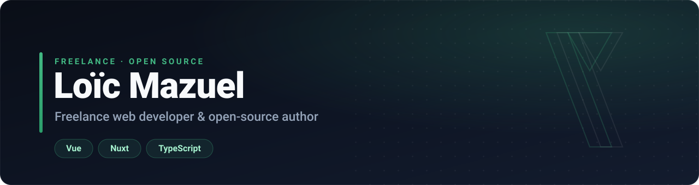
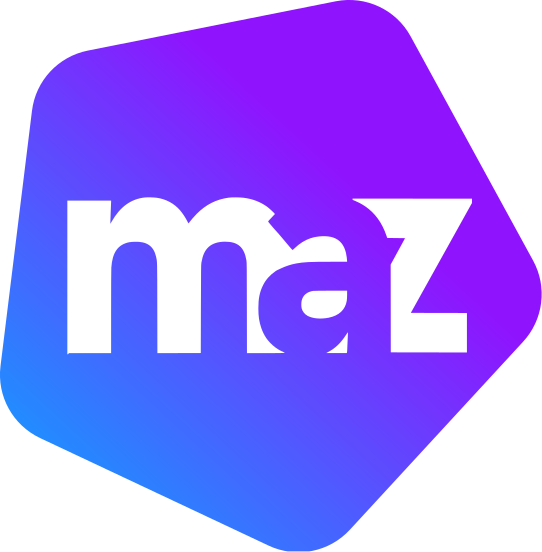

  

  
  
  

**575k+ monthly npm downloads** across 33+ open-source repositories &nbsp;·&nbsp; **2.1k+** GitHub stars. 
I build UI libraries, developer tools and full-stack apps with Vue, Nuxt, Node &amp; TypeScript.

## Open Source

  
  <b><a href="https://maz-ui.com">Maz-UI</a></b> 
  Lightweight, tree-shakeable UI library &amp; toolkit for Vue&nbsp;3 and Nuxt - components, composables, directives, theming and a Nuxt module. 
  
  
  &nbsp;<a href="https://maz-ui.com">Docs</a> · <a href="https://www.npmjs.com/package/maz-ui">npm</a> · <a href="https://github.com/LouisMazel/maz-ui">GitHub</a>

  
  <b><a href="https://relizy.dev">Relizy</a></b> 
  Automated release manager for monorepos and single packages - versioning, changelogs, npm publishing and GitHub/GitLab releases. 
  
  
  &nbsp;<a href="https://relizy.dev">Docs</a> · <a href="https://www.npmjs.com/package/relizy">npm</a> · <a href="https://github.com/LouisMazel/relizy">GitHub</a>

## Products

  
  <b><a href="https://panenk.app/en">Panenk.app</a></b> 
  Football prediction game to play with your mates - live scores, real-time leaderboards, no ads, no install. 
  <a href="https://panenk.app/en">panenk.app →</a>

 

Available for freelance work · previously with LiveMentor &amp; Norauto · <a href="https://www.loicmazuel.com/contact">Let's talk →</a>
